# SyAi Notes App System Design

## 1. Introduction

SyAi Notes is a premium Android note-taking application designed for rich handwritten, typed, and AI-assisted note creation. The system combines a document-style editor, page-based layout, structured content storage, PDF export, preview generation, and AI-powered content assistance in a single workflow.

This document describes the system design of the notes app from four perspectives:

- product workflow
- user interface flow
- software architecture
- data and rendering pipeline

The goal of the design is to provide:

- a smooth editor experience similar to modern document and note apps
- page-accurate rendering using points as the source unit
- strong separation between UI, state, model, persistence, and export
- extensibility for AI, media, drawing, and structured note features

---

## 2. Design Goals

### Functional Goals

- Create and edit notes with multiple pages
- Support linear text, floating text blocks, drawings, images, and lists
- Support inline formatting like size, color, bold, italic, underline, and alignment
- Allow object selection, movement, resize, layering, and deletion
- Export notes to PDF with stable sizing
- Show note previews on the home screen
- Support AI-generated text and drawing assistance

### Non-Functional Goals

- Smooth interaction and minimal perceived lag
- Stable rendering across devices and export formats
- Scalable architecture for future tools
- Clear undo/redo behavior
- Safe persistence with background autosave

---

## 3. High-Level Product Workflow

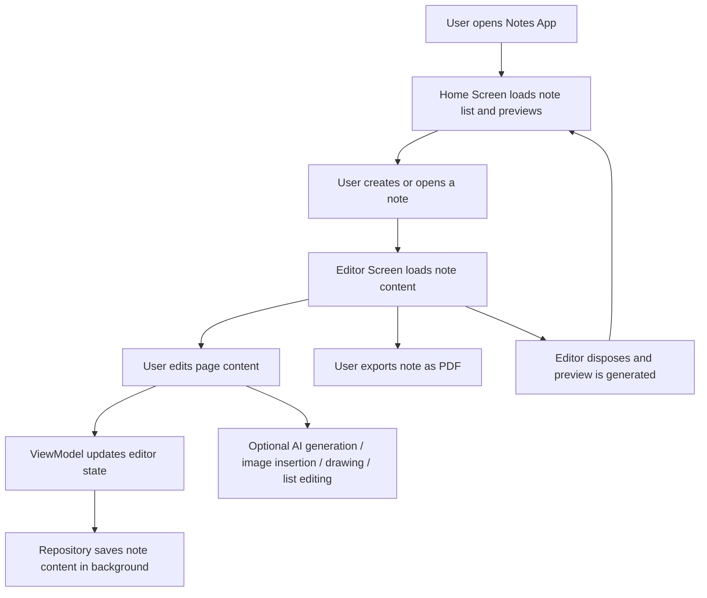

---

## 4. UI Flow

## 4.1 Main Screens

The app uses three major user-facing layers:

1. Home Screen
2. Note Editor Screen
3. Supporting dialogs and sheets

## 4.2 Home Screen Flow

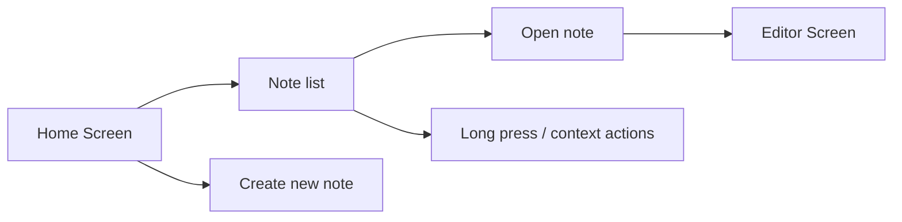

### Home Screen Responsibilities

- show note cards
- load preview images from local storage/database
- allow note creation
- open existing note
- expose note context menu actions

## 4.3 Editor Screen Flow

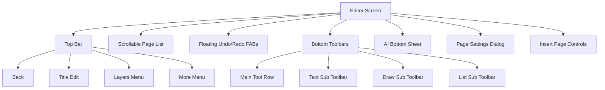

## 4.4 Editor Interaction Flow

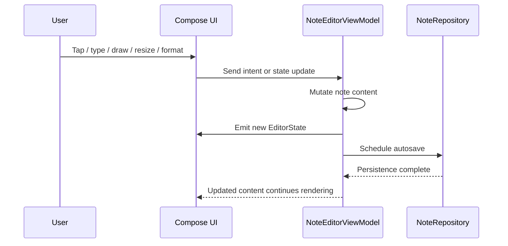

---

## 5. Architectural Style

The notes app follows a layered Android architecture with a unidirectional editor state flow.

### Layers

- Presentation Layer
- Domain/Editor State Layer
- Data/Persistence Layer
- External Service Layer

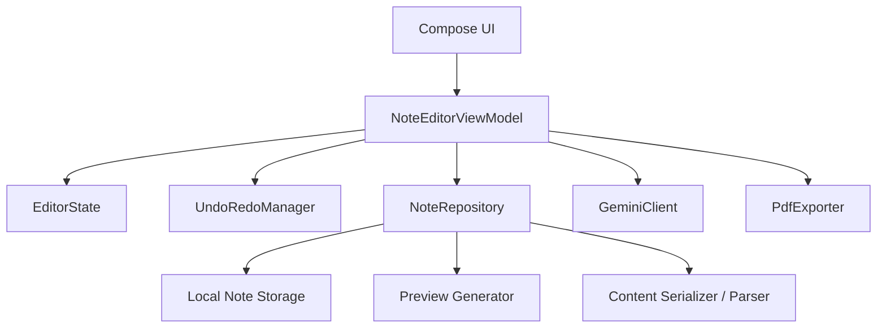

### Architecture Benefits

- UI remains declarative and reactive
- ViewModel acts as the main orchestration point
- model classes stay serializable and export-friendly
- data storage and file generation remain isolated from UI logic

---

## 6. Module-Level System Design

## 6.1 Presentation Layer

Main responsibilities:

- render note pages
- render floating objects and linear content
- handle gestures and taps
- show bottom sheets, dialogs, toolbars, and overlays
- reflect current selection and active tool

Important UI components:

- `NoteEditorScreen`
- `ManualLinearTextEditor`
- `RenderObject`
- `RenderListRecursive`
- `HoveringTextToolbar`
- `EditorBottomToolbar`
- `ResizeHandles`

## 6.2 ViewModel Layer

Main responsibilities:

- hold `EditorState`
- process all editor actions
- update note content
- trigger autosave
- coordinate undo/redo
- coordinate AI generation and PDF export
- normalize page/object state

Important class:

- `NoteEditorViewModel`

## 6.3 Data Layer

Main responsibilities:

- load note metadata
- load note content JSON
- update note title and content
- generate note previews
- save editor output

Important classes:

- `NoteRepository`
- payload adapter / serializer
- preview generation helpers

## 6.4 External Services

Main responsibilities:

- AI object generation
- PDF export
- optional offline image model download flow

Important classes:

- `GeminiClient`
- `PdfExporter`

---

## 7. Core Data Model

The system uses a document-based model with pages as the primary container. Every note contains multiple pages, and every page contains both page-flow content and floating objects.

## 7.1 Entity Hierarchy

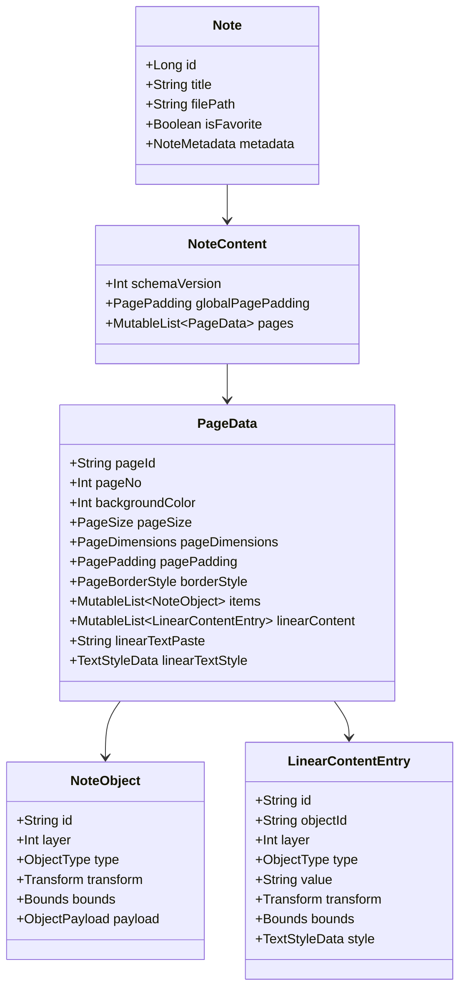

## 7.2 Page Unit System

The editor uses points as the canonical internal unit.

- 1 point = 1/72 inch
- page width and height are stored in points
- object positions and sizes are stored in points
- text size is stored in points
- UI rendering converts points to dp/sp dynamically

### Why Points Were Chosen

- stable PDF export
- consistent page layout
- accurate cross-device scaling
- simpler page-to-export transformation

---

## 8. Content Model Strategy

The app uses two complementary content representations inside each page:

1. `linearContent`
2. `items`

### `linearContent`

This is the logical reading order of the page. It is the source for:

- main linear text flow
- inline list blocks
- inline image blocks
- ordering of structured content on a page

### `items`

This is the renderable object collection for:

- floating text blocks
- drawings
- images
- lists
- checklists
- selectable objects

### Design Rule

`linearContent` defines document flow and ordering.

`items` defines object payload and geometric render state.

This separation allows the system to behave partly like a document editor and partly like a canvas editor.

---

## 9. Editor State Design

The editor uses a centralized `EditorState` object to drive the UI.

### Important State Fields

- current page index
- active tool
- selected object ID
- selected linear page ID
- active linear text ID
- global text selection
- current text style
- drawing color and width
- brush style
- page viewport state
- loading and offline model state

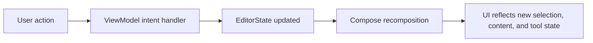

### Why Central State Matters

- consistent toolbar behavior
- deterministic selection logic
- easier undo/redo control
- better synchronization between pages, tools, and overlays

---

## 10. Rendering Pipeline

The editor rendering model is hybrid.

### Layered Rendering Strategy

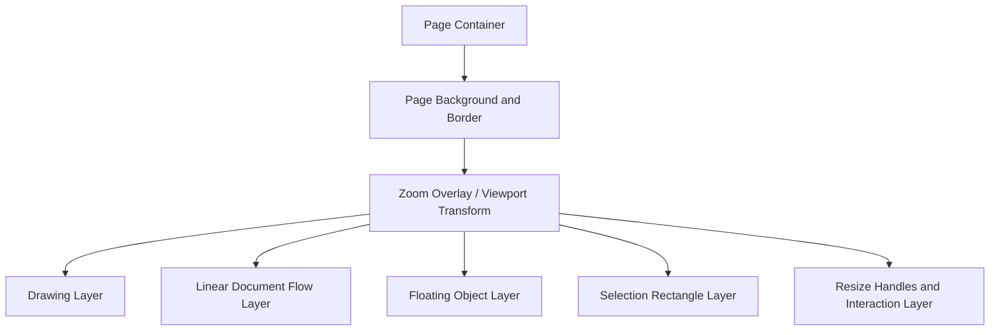

### Rendering Order

1. page background
2. page border
3. drawing strokes
4. linear content flow
5. floating objects
6. selection overlay
7. resize handles and drag indicators

### Rendering Benefits

- keeps document flow independent from floating objects
- allows selection and resize on top of content
- supports page-level zoom and visual overlays

---

## 11. Linear Text Engine

The app is moving from `TextField`-based editing toward manual page text rendering.

### Responsibilities of the Manual Text Engine

- draw text directly on the page
- handle cursor placement
- show blinking cursor
- support manual text selection
- support selection toolbar actions
- apply inline spans for style changes
- trigger page overflow logic

### Linear Text Rules

- text flow begins from page padding, not arbitrary tap positions
- line alignment is relative to page content width
- formatting can apply to selection or next inserted text
- overflow beyond page content height should continue to next page

---

## 12. List System Design

Lists are treated as structured content blocks that may appear within document flow.

### Supported List Types

- unordered bullets
- ordered numeric lists
- alphabetic ordered lists
- roman ordered lists
- checklist lists

### List Configuration Features

- marker type selection
- checklist toggle state
- bullet style variants
- ordered style variants
- nested list support in the model

### List Rendering Goal

Lists should behave like word-processor content rather than detached top-left canvas objects.

---

## 13. Drawing System Design

The drawing subsystem stores strokes in page-space point coordinates.

### Drawing Data

- each stroke has a unique ID
- each point has a unique ID
- stroke width is stored in points
- brush style is stored per stroke

### Supported Brush Styles

- pen
- pencil
- marker
- highlighter
- eraser

### Drawing Flow

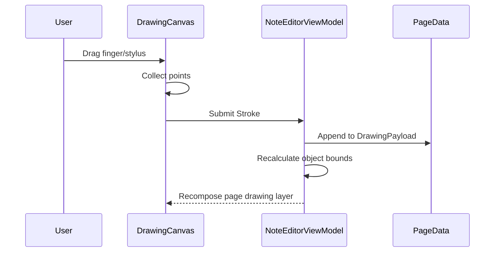

### Design Benefits

- device-independent coordinates
- accurate export to PDF
- future smoothing/AI-assisted cleanup support

---

## 14. Selection, Move, Resize, and Layering

Objects use a page-space transform and bounds model.

### Selection System

- single object selection
- dashed selection frame
- resize handles
- layer-based z-order rendering

### Movement Rules

- dragging updates `transform.x` and `transform.y`
- movement is clamped to page padding and page bounds
- cross-page move may transfer object between pages when required

### Resize Rules

- width and height are stored in points
- resize is clamped so the object remains inside page content

### Layer Management

- every object has a `layer`
- layers determine visual stacking order
- deleting a layer should renormalize other layers
- top bar exposes a layer management menu

---

## 15. Page Zoom Design

Each page stores its own viewport state.

### Viewport Fields

- scale
- offset X
- offset Y

### Why Per-Page Zoom

- allows each page to preserve its own zoom state
- avoids a global zoom that breaks scrolling context
- improves document navigation in long notes

### User Experience Goal

When zooming:

- the page itself should feel zoomed
- handles or page outline should make the zoom state obvious
- single-finger scrolling should remain smooth

---

## 16. Undo/Redo Design

Undo and redo are managed through a dedicated manager and serialized content snapshots.

### Strategy

- content snapshots are pushed at controlled intervals
- frequent tiny edits are coalesced to reduce lag
- undo restores a consistent page-focused state

### Benefits

- prevents UI stutter from excessive snapshot creation
- keeps user actions reversible
- supports complex operations like insert, resize, format, and delete

---

## 17. Persistence and Autosave

The repository persists note content in background.

### Persistence Flow

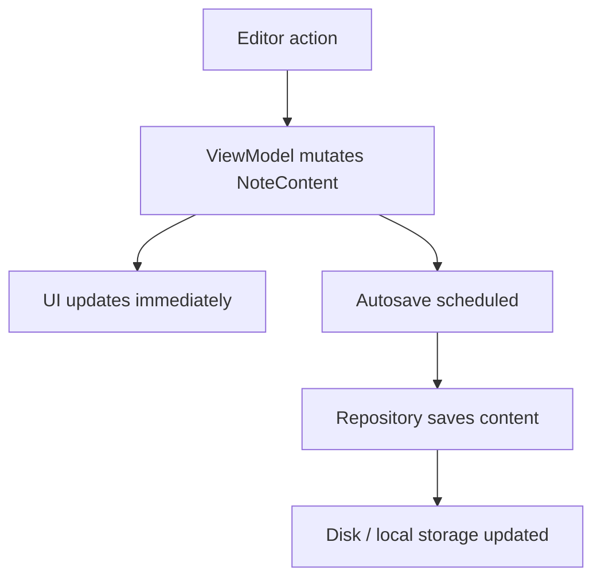

### Design Principle

UI updates must be immediate. Serialization and save operations should not block interaction.

---

## 18. Preview Generation

The home screen displays visual note previews.

### Preview Strategy

- when editor closes, preview generation is triggered
- preview image is saved and associated with note ID
- if preview is missing, first page can be rendered and cached

### Benefits

- visually rich home screen
- faster note identification
- reusable preview cache

---

## 19. PDF Export Architecture

The PDF subsystem converts point-based page content into a page-accurate export file.

### Export Flow

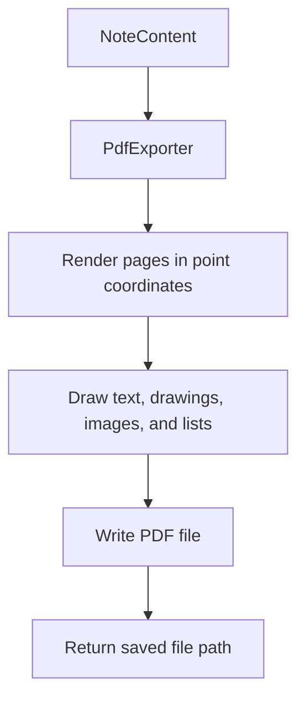

### PDF Design Requirement

All page sizes, object coordinates, and text sizes must come from point-based values to avoid scale mismatch between editor view and exported document.

---

## 20. AI Tool Design

The app includes AI support for generating note content and, in future, image generation.

### Current AI Objectives

- generate structured note objects
- generate page-aware content
- use context from previous, current, and next page
- support text, list, and drawing suggestions

### AI Context Model

The current screen page is primary context, with neighboring pages as support context.

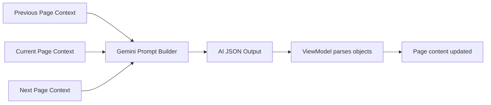

### Future AI Extensions

- prompt-based image generation
- AI beautification of rough sketches
- AI-generated layouts
- contextual study note generation

---

## 21. Page Insertion Workflow

The editor supports dynamic page insertion between existing pages.

### Workflow

1. user taps the insert bar between pages
2. bar transitions into a circular FAB
3. FAB expands page-size options
4. selected page type is inserted at that location
5. subsequent pages are renumbered

### Supported Page Types

- A4
- A3
- custom size

---

## 22. Security and Reliability Considerations

### Data Integrity

- schema versioning is used for content normalization
- legacy content can be normalized to current format
- IDs are unique for pages, objects, strokes, and points

### Reliability

- autosave protects ongoing edits
- undo/redo protects against accidental loss
- page content is normalized before export and rendering

### Performance

- page-local viewport state reduces unnecessary global recalculation
- throttled undo snapshots reduce mutation overhead
- rendering is split by page and content type

---

## 23. Limitations and Future Scope

### Current Limitations

- some advanced inline rich-text cases still need refinement
- perfect gesture feel requires device testing
- offline image generation backend is not yet fully integrated
- complex nested list editing can be improved further

### Future Enhancements

- collaborative editing
- cloud sync
- handwriting-to-text conversion
- advanced AI image generation
- template-based notes
- audio notes with synchronized text

---

## 24. Conclusion

The SyAi Notes system is designed as a hybrid document-and-canvas note editor with a strong emphasis on point-based layout accuracy, page-driven content flow, and extensibility. The architecture separates rendering, state management, persistence, and AI integration so that the product can continue evolving without rewriting the full editor core.

The design supports both academic reporting and practical software scaling by combining:

- a clear page-based document model
- structured editor state management
- modern Compose UI rendering
- background persistence and export
- AI-assisted content generation

This makes the system suitable for a next-generation note-taking experience aimed at smooth interaction, accurate export, and rich content authoring.

