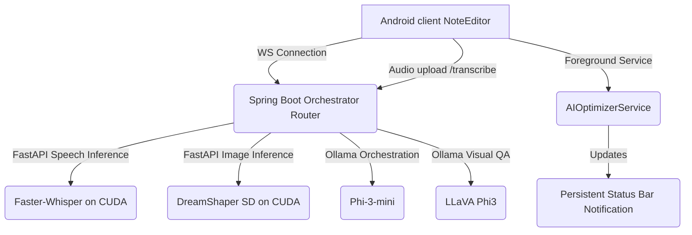

# SyAi Local Multi-Turn Visual AI Orchestration & Whisper Integration Guide

This document outlines the architecture, integration patterns, and operational details of SyAi's new CUDA-accelerated local multi-turn AI visual orchestrator and speech-to-text loop.

---

## 1. System Architecture Overview

SyAi utilizes a high-performance orchestration layer to execute continuous, visually verified canvas optimization loops locally on the user's RTX 3050 hardware.

---

## 2. Dynamic Bidirectional Stream Feedback Loop

The continuous multi-turn Visual AI loop provides real-time changes directly to Jetpack Compose while optimizing prompt objects and visually inspecting results.

### Operational Sequence:
1. **Initiate Session**: The user clicks the AI button or records a request via Whisper.
2. **WebSocket Handshake**: [AIOptimizerOrchestrator](file:///c:/Users/Vidhan/AndroidStudioProjects/SyAi-Public/app/src/main/java/com/mato/syai/note/ai/AIOptimizerOrchestrator.kt) starts a connection to Spring Boot `/api/v1/ai/stream` while bringing up the [AIOptimizerService](file:///c:/Users/Vidhan/AndroidStudioProjects/SyAi-Public/app/src/main/java/com/mato/syai/note/ai/AIOptimizerService.kt) to keep the app active in the background.
3. **Prompt Optimization**: The router prompts local **Phi-3-mini** to optimize prompt objects, adding negative prompts, and determining layout actions.
4. **Action Execution**:
    - **TEXT**: Phi-3 generates markdown text blocks.
    - **DRAWING**: Phi-3 maps out elegant drawing stroke arrays.
    - **IMAGE**: FastAPI runs Stable Diffusion with DreamShaper on CUDA, returns raw JPEG data, and inserts it.
5. **Render & Send Feedback**: The Spring Boot router requests visual validation (`VERIFY_REQUEST`). The Android client captures the page content, renders it to a `Bitmap` via [PdfExporter](file:///c:/Users/Vidhan/AndroidStudioProjects/SyAi-Public/app/src/main/java/com/mato/syai/note/data/local/parser/PdfExporter.kt), base64-encodes it, and streams it back.
6. **Visual Inspection**: The server sends the base64 canvas image to **LLaVA Phi3** to visually analyze the page alignment, confirming if the prompt requirement is fully satisfied.
7. **Complete or Refine**: If LLaVA returns `FINISHED`, the loop terminates. Otherwise, LLaVA generates refined adjustment instructions, and the loop repeats.

---

## 3. UI and Database State Synchronizations

*   **Pulsing Status Bar Icon**: If the WebSocket stream is active, a glowing and pulsing [AutoAwesome](file:///c:/Users/Vidhan/AndroidStudioProjects/SyAi-Public/app/src/main/java/com/mato/syai/note/ui/editor/NoteEditorScreen.kt) icon appears in the `EditorTopBar`. Tapping it cancels the background optimizer instantly.
*   **Seen State Synchronization**: Local Room Database stores visual suggestion seen states via `AIUpdateEntity` and `NotesDao`, ensuring revisit states do not trigger redundant re-processing.
*   **Speech-to-Text Mic Dialog**: Launching speech-to-text triggers a premium voice input overlay showing a pulsing record animation which calls Faster-Whisper to transcribe and populate text input.
