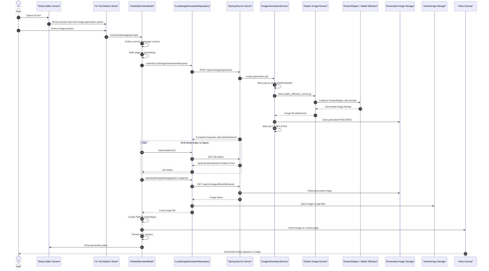
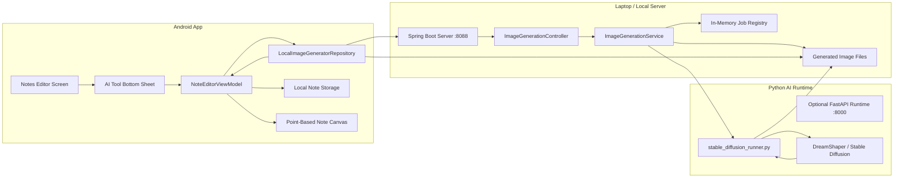

# AI Image Generation Flow

This document explains how image generation moves through SyAi Notes, starting from the Notes Editor UI and ending with the generated image being inserted back into the app.

## Sequence Diagram

## Component Diagram

## High-Level Workflow

1. The user opens the AI tool from the Notes Editor.
2. The AI Tool Bottom Sheet collects the image prompt.
3. `NoteEditorViewModel` gathers the current note/page context and starts the image-generation request asynchronously.
4. `LocalImageGeneratorRepository` sends the request to the Spring Boot server.
5. Spring Boot creates a generation job and delegates image generation to the Python runner.
6. The Python runner loads/runs DreamShaper or Stable Diffusion and saves the generated image.
7. Spring Boot marks the job as completed and exposes the generated image through a file endpoint.
8. The Android app polls the job status while the editor is open.
9. Once completed, Android downloads the generated image into app storage.
10. `NoteEditorViewModel` creates an `IMAGE` object and inserts it into the current note page.
11. The note content is persisted and the generated image appears on the canvas.

## Important Design Points

- The Android UI stays responsive because generation is asynchronous.
- The Spring Boot server acts as a LAN bridge between the phone and the AI runtime.
- The Python runner owns the heavy model execution so Android does not need to run Stable Diffusion locally.
- Generated images are stored as files, then referenced by the note model.
- The editor inserts the final result as a normal image object, so it can be moved, resized, selected, exported, and persisted like other note content.

